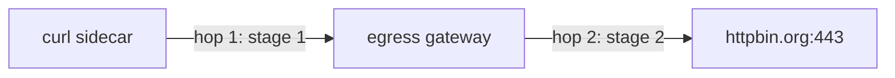

# The Two-Stage `VirtualService`

One flight plan, two legs, two different proxies. This is the shape to memorise, astronaut, and the `match.gateways` field is what keeps the two legs apart.

## Two hops

Through an egress gateway, a signal travels in two steps, or **hops**. First it flies from the app's communications officer (sidecar) to the departure gate (egress gateway). Then it flies from the gate out of the solar system, to the internet.



Both hops are written in one `VirtualService` — one flight plan with two legs. Which leg runs in which proxy is decided entirely by the `gateways` list on each rule: hop 1 is the rule for `gateways: mesh`, hop 2 the rule for `gateways: egress-gateway`.

Four objects work together, and each has one job:

| Object | Job |
| --- | --- |
| `ServiceEntry` `httpbin-org` | puts `httpbin.org` on the star chart (Part 1) |
| `Gateway` `egress-gateway` | the egress pods accept TLS for `httpbin.org` on `443` (Part 1) |
| `DestinationRule` `egress-gateway-for-httpbin-org` | a named subset of the egress Service — the target of hop 1 (Part 1) |
| `VirtualService` `httpbin-org-via-egress` | hop 1 (rule for `mesh`) and hop 2 (rule for the gateway) — this part |

## Encrypted traffic: TLS passthrough

The app calls `https://httpbin.org`, so the traffic is encrypted the whole way. TLS is the name of that lock. Neither the sidecar nor the egress gateway can read the HTTP request inside it.

Instead, they route by the host name the client sends at the very start of the TLS connection, during the handshake. This name is the **SNI** (Server Name Indication). Think of it as the destination planet written on the outside of a sealed signal capsule: the crew cannot open the capsule, but they can read where it is going.

That is why the `Gateway` in Part 1 uses `tls.mode: PASSTHROUGH`, and why the `VirtualService` below uses **`tls:` routes with `sniHosts`**, not `http:` routes.

## One document, two places

```yaml
apiVersion: networking.istio.io/v1
kind: VirtualService
metadata:
  name: httpbin-org-via-egress
  namespace: bookinfo
spec:
  hosts:
    - httpbin.org
  gateways:
    - mesh                 # ← the sidecars
    - egress-gateway       # ← the gateway
  tls:
    # Stage 1 — runs in the SIDECARS: send it to the gateway
    - match:
        - gateways: [mesh]
          port: 443
          sniHosts: [httpbin.org]
      route:
        - destination:
            host: istio-egress.istio-egress.svc.cluster.local
            subset: httpbin-org
            port:
              number: 443
    # Stage 2 — runs on the GATEWAY: send it to the real host
    - match:
        - gateways: [egress-gateway]
          port: 443
          sniHosts: [httpbin.org]
      route:
        - destination:
            host: httpbin.org
            port:
              number: 443
```

Hop 1 goes to the egress gateway's **Service**, by its full name. Hop 2 goes to the external host.

## `mesh` — the name you have been using all along

`mesh` is a **reserved gateway name meaning "all sidecars"**. You met it implicitly in section 060: a `VirtualService` with no `gateways` field applies to `mesh`.

Here it is written out explicitly so it can sit beside a real gateway name in the same `gateways` list, and so each rule can say which of the two it belongs to.

That is the mechanism that makes one document configure two different proxies:

| `match.gateways` | The rule is programmed into | It says |
| --- | --- | --- |
| `[mesh]` | every sidecar | "do not go direct — go to the gateway" |
| `[egress-gateway]` | the gateway proxy | "you are the gateway; go to the real host" |

Get those two backwards and the signal either flies in circles (the gate told to send to the gate) or never changes course, because the sidecar rule went onto the gate, where no app signals arrive.

The top-level `gateways` list must name **both**. Omit `mesh` and stage 1 is never programmed into sidecars, so nothing is ever diverted; omit the gateway name and stage 2 never reaches the gateway, so it has no idea what to do with the traffic it receives. Part 3 makes both mistakes on purpose.

## The `ServiceEntry` is still required

Nothing here replaces section 070. `httpbin.org` must be on the star chart, or neither stage has a host to route. On a `REGISTRY_ONLY` mesh it is also what permits the traffic at all.

Apply the `Gateway` and the `DestinationRule` before the `VirtualService`, because the `VirtualService` points at both. This is the "make before break" order: nothing changes until the `VirtualService` arrives, so there is never a moment when a route points at something that does not exist yet.

> [!TIP]
> **Try it — route the external host through the gateway, and see both hops**
>
> The `ServiceEntry` from Part 1 is still applied.
>
> ```sh
> cat > gateway-egress-httpbin-org.yaml <<'EOF'
> apiVersion: networking.istio.io/v1
> kind: Gateway
> metadata:
>   name: egress-gateway
>   namespace: bookinfo
> spec:
>   selector:
>     istio: egress
>   servers:
>     - port:
>         number: 443
>         name: tls
>         protocol: TLS
>       hosts:
>         - httpbin.org
>       tls:
>         mode: PASSTHROUGH
> EOF
> cat > destinationrule-egress-gateway.yaml <<'EOF'
> apiVersion: networking.istio.io/v1
> kind: DestinationRule
> metadata:
>   name: egress-gateway-for-httpbin-org
>   namespace: bookinfo
> spec:
>   host: istio-egress.istio-egress.svc.cluster.local
>   subsets:
>     - name: httpbin-org
> EOF
> cat > virtualservice-httpbin-org-via-egress.yaml <<'EOF'
> apiVersion: networking.istio.io/v1
> kind: VirtualService
> metadata:
>   name: httpbin-org-via-egress
>   namespace: bookinfo
> spec:
>   hosts:
>     - httpbin.org
>   gateways:
>     - mesh
>     - egress-gateway
>   tls:
>     - match:
>         - gateways: [mesh]
>           port: 443
>           sniHosts: [httpbin.org]
>       route:
>         - destination:
>             host: istio-egress.istio-egress.svc.cluster.local
>             subset: httpbin-org
>             port:
>               number: 443
>     - match:
>         - gateways: [egress-gateway]
>           port: 443
>           sniHosts: [httpbin.org]
>       route:
>         - destination:
>             host: httpbin.org
>             port:
>               number: 443
> EOF
> kubectl apply -f gateway-egress-httpbin-org.yaml
> kubectl apply -f destinationrule-egress-gateway.yaml
> kubectl apply -f virtualservice-httpbin-org-via-egress.yaml
> call_external
> log_hop1_sidecar
> log_hop2_egress
> ```
>
> Expect `200`, then:
>
> ```text
> ... "10.244.0.24:443" outbound|443|httpbin-org|istio-egress.istio-egress.svc.cluster.local ...
> ... "107.21.166.194:443" outbound|443||httpbin.org ... httpbin.org
> ```
>
> (Trimmed; IPs vary.) The same `200` as before: from the app's side nothing changed. But hop 1 now ends at the egress **pod** (the gate's spaceship), and the internet IP only shows up in hop 2. The `|httpbin-org|` in the middle of the first cluster name is the subset from the otherwise-pointless `DestinationRule` — the same cluster-naming format as section 020's weighted routing, which is a reminder that none of this is special machinery.

## The same shape for plain HTTP

For a plain-HTTP external call, the stages are `http:` rules matched by `port` alone, because the proxies can read the request. This is the shape the graded lab uses, with the demo profile's gateway names:

```yaml
spec:
  hosts:
    - httpbin.org
  gateways:
    - mesh
    - istio-egressgateway
  http:
    - match:
        - gateways: [mesh]
          port: 80
      route:
        - destination:
            host: istio-egressgateway.istio-system.svc.cluster.local
            subset: httpbin
            port:
              number: 80
    - match:
        - gateways: [istio-egressgateway]
          port: 80
      route:
        - destination:
            host: httpbin.org
            port:
              number: 80
```

With `http:` routes, stage 1 is visible in the sidecar's route table. `istioctl proxy-config routes <pod> --name 80 -o json` shows a cluster such as `outbound|80|httpbin|istio-egressgateway.istio-system.svc.cluster.local` — the sidecar's destination for `httpbin.org` is an **in-cluster Service**. A `tls:` route has no HTTP route table to dump, which is why the access log is the evidence in the passthrough case.

> *One `VirtualService`, two rule sets, two proxies — `match.gateways` decides which proxy each rule is programmed into.*

## Common pitfalls

> [!WARNING]
> **Writing one rule and expecting both hops.** Each rule belongs to one stage. A rule for `mesh` does not configure the gateway, and a rule for the gateway does not redirect the sidecar.
>
> **Omitting `mesh` from the `gateways` list.** Naming the gateway alone replaces the implicit `mesh`, so sidecars keep going direct and the gateway is never used.
>
> **Writing `http:` routes for HTTPS traffic.** The proxies cannot read inside the TLS lock. Passthrough traffic needs `tls:` routes with `sniHosts`.
>
> **Dropping the `ServiceEntry`.** It is still required. The external host has to be in the registry for either stage to resolve it.
>
> **Putting the two stages in the wrong order.** Stage 1 sends to the gateway, stage 2 sends to the external host. Reversing them produces a loop or a dead end.
>
> **Applying the `VirtualService` first.** Until the `DestinationRule` exists, hop 1 points at a subset nobody defined and fails with `NC`. Make before break.
