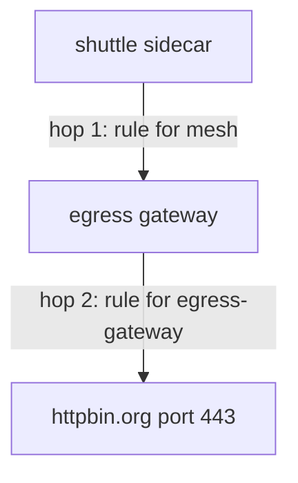

# The Two-Stage `VirtualService`

One flight plan, two legs, two different proxies. This is the shape to learn by heart, astronaut. In this part you write it, apply it, and watch a signal fly through the gate in both flight logs.

## Two hops

Through an egress gateway, a signal travels in two steps, called **hops**. First it flies from the shuttle's communications officer to the departure gate. Then it flies from the gate out of the solar system, to the internet.



Both hops are written in **one** `VirtualService`. Which rule runs in which proxy is decided by the `gateways` list in each rule's `match`.

Four objects work together, and each has one job:

| Object | Its job |
| --- | --- |
| `ServiceEntry` `httpbin-org` | puts `httpbin.org` on the star chart |
| `Gateway` `egress-gateway` | the gate's pods accept TLS for `httpbin.org` on port `443` |
| `DestinationRule` `egress-gateway-for-httpbin-org` | names the subset of the gate's Service that hop 1 flies to |
| `VirtualService` `httpbin-org-via-egress` | hop 1 (the rule for `mesh`) and hop 2 (the rule for the gate) |

## Routing a sealed signal by its name

The shuttle calls `https://httpbin.org`, so the signal is encrypted the whole way. Neither the sidecar nor the gate can read the HTTP request inside it.

What they can read is the host name the client sends at the very start of the TLS connection, during the handshake. This name is the **SNI** (Server Name Indication). Think of it as the destination planet painted on the outside of a sealed cargo capsule: the crew cannot open it, but they can read where it is going.

That is why the `Gateway` uses `tls.mode: PASSTHROUGH`, and why the flight plan below uses **`tls` rules that match on `sniHosts`**, not `http` rules.

## `mesh`: the name for every sidecar

`mesh` is a **reserved gateway name**. It means "every sidecar in the mesh". You have used it all along without writing it: a `VirtualService` with no `gateways` field applies to `mesh`.

Here you write it out, so it can stand next to a real gateway name. That gives two places it is used:

- **The top-level `gateways` list** says which proxies get this flight plan at all. It must name **both** `mesh` and `egress-gateway`.
- **The `gateways` list in each rule's `match`** says which of those proxies that one rule is for.

| `match.gateways` | The rule is programmed into | It says |
| --- | --- | --- |
| `mesh` | every sidecar | "do not fly direct: fly to the gate" |
| `egress-gateway` | the gate's pods | "you are the gate: fly to the real host" |

Get the two the wrong way round and the signal either flies in circles (the gate told to send to the gate), or never changes course, because the sidecar rule went to the gate, where no shuttle signals start.

<!-- astrona:playground:renew -->

### Route the signal through the gate

The `ServiceEntry`, the `Gateway` and the `DestinationRule` must still be applied. Save this as `virtualservice-httpbin-org-via-egress.yaml`:

```yaml
apiVersion: networking.istio.io/v1
kind: VirtualService
metadata:
  name: httpbin-org-via-egress
  namespace: starfleet
spec:
  hosts:
  - httpbin.org
  gateways:
  - mesh
  - egress-gateway
  tls:
  - match:
    - gateways:
      - mesh
      port: 443
      sniHosts:
      - httpbin.org
    route:
    - destination:
        host: istio-egress.istio-egress.svc.cluster.local
        subset: httpbin-org
        port:
          number: 443
  - match:
    - gateways:
      - egress-gateway
      port: 443
      sniHosts:
      - httpbin.org
    route:
    - destination:
        host: httpbin.org
        port:
          number: 443
```

The first rule is hop 1: in every sidecar, a signal to `httpbin.org` on port `443` flies to the gate's Service, by its full name and subset. The second rule is hop 2: on the gate, the same signal flies on to the real `httpbin.org`.

Apply it:

```sh
kubectl apply -f virtualservice-httpbin-org-via-egress.yaml
```

Then send a signal and read **both** flight logs:

```sh
call_external
log_shuttle
log_gate
```

You should see (log lines trimmed):

```text
200 0.480009s
  exit=0
"- - -" 0 - - - "-" 901 4875 590 - "-" "-" "-" "-" "10.244.0.6:443" outbound|443|httpbin-org|istio-egress.istio-egress.svc.cluster.local ... httpbin.org -
"- - -" 0 - - - "-" 901 4875 587 - "-" "-" "-" "-" "34.227.237.26:443" outbound|443||httpbin.org ... httpbin.org -
```

The same `200` as before: from the shuttle's side, nothing changed. But read the two lines:

- **Hop 1, the shuttle's log**, now ends at `10.244.0.6:443`, the gate's pod inside your cluster. Its cluster name carries the subset in the middle: `outbound|443|httpbin-org|istio-egress...`. That is the empty subset at work.
- **Hop 2, the gate's log**, ends at an internet address, through the cluster `outbound|443||httpbin.org`. Only the gate talked to the internet.

## Reading the orders in both proxies

The flight logs show what happened to one signal. The proxies' configuration shows what will happen to every signal. Look at the shuttle's listener on port `443` first:

```sh
istioctl proxy-config listener deploy/shuttle -n starfleet --port 443
```

You should see:

```text
ADDRESSES   PORT MATCH            DESTINATION
0.0.0.0     443  ALL              PassthroughCluster
0.0.0.0     443  SNI: httpbin.org Cluster: outbound|443|httpbin-org|istio-egress.istio-egress.svc.cluster.local
10.96.0.1   443  ALL              Cluster: outbound|443||kubernetes.default.svc.cluster.local
10.96.118.9 443  ALL              Cluster: outbound|443||istio-egress.istio-egress.svc.cluster.local
10.96.20.17 443  ALL              Cluster: outbound|443||istiod.istio-system.svc.cluster.local
```

The second row is hop 1: a signal with the SNI name `httpbin.org` goes to the gate's subset. Every other unknown host still falls through to `PassthroughCluster`, because the mesh is at `ALLOW_ANY`. Now the gate:

```sh
istioctl proxy-config listener deploy/istio-egress -n istio-egress
```

```text
ADDRESSES PORT  MATCH            DESTINATION
0.0.0.0   443   SNI: httpbin.org Cluster: outbound|443||httpbin.org
0.0.0.0   15021 ALL              Inline Route: /healthz/ready*
0.0.0.0   15090 ALL              Inline Route: /stats/prometheus*
```

The gate finally has a listener on `443`. It matches the same SNI name and sends the signal to the real host. That is hop 2. One object, two proxies, two different orders.

## The same shape for plain HTTP

When the outside host is called with plain `http://`, the proxies can read the request, so the two stages are `http` rules instead of `tls` rules. Only the parts that change are shown here: the `ServiceEntry` port is `HTTP` on `80`, the `Gateway` server is `HTTP` on `80` with the same outside host, and the flight plan becomes:

```yaml
  http:
  - match:
    - gateways:
      - mesh
      port: 80
    route:
    - destination:
        host: istio-egress.istio-egress.svc.cluster.local
        subset: httpbin-org
        port:
          number: 80
  - match:
    - gateways:
      - egress-gateway
      port: 80
    route:
    - destination:
        host: httpbin.org
        port:
          number: 80
```

With `http` rules, hop 1 also shows in the shuttle's route table: `istioctl proxy-config routes deploy/shuttle -n starfleet --name 80 -o json` lists the cluster `outbound|80|httpbin-org|istio-egress.istio-egress.svc.cluster.local`. A `tls` rule has no route table, so for HTTPS you read the listener, as you did above.

## Common pitfalls

> [!WARNING]
> - **Writing one rule and expecting both hops.** Each rule belongs to one stage. A rule for `mesh` does not configure the gate, and a rule for the gate does not steer the sidecar.
> - **Leaving `mesh` out of the top-level `gateways` list.** Naming only the gate replaces the silent `mesh`, so the sidecars never get hop 1 and keep flying direct.
> - **`http` rules for HTTPS.** The proxies cannot read inside the TLS lock. A sealed signal needs `tls` rules with `sniHosts`.
> - **Swapping the two `match.gateways` values.** `mesh` is hop 1, the gate's name is hop 2. Swapped, signals loop or never leave.
> - **Applying the `VirtualService` first.** Until the `DestinationRule` exists, hop 1 points at a subset nobody defined. Make before break.

> *One `VirtualService`, two rules, two proxies. `match.gateways` decides which proxy runs each rule.*
