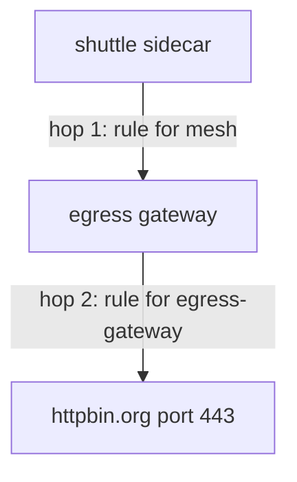

# Write The Two-Stage `VirtualService`

The `Gateway` and the `DestinationRule` for the egress gateway do nothing on their own. One `VirtualService` makes them work, and it configures two different proxies at once. A **`VirtualService`** sets how requests to a host are routed: match rules, read top to bottom, and the destination for each. In this part you write the two-stage `VirtualService`, apply it, and see one request pass the egress gateway in both access logs.

## Two hops

Through an egress gateway, a request travels in two steps, called **hops**. In hop 1, the `shuttle` sidecar sends the request to the egress gateway. In hop 2, the egress gateway sends it out of the cluster, to the internet.



The diagram shows hop 1 from the `shuttle` sidecar to the egress gateway, and hop 2 from the egress gateway to `httpbin.org` on port `443`.

Both hops are written in **one** `VirtualService`. The `gateways` list in each rule's `match` decides which proxy runs that rule.

Four objects work together, and each has one job:

| Object | Its job |
| --- | --- |
| `ServiceEntry` `httpbin-org` | adds `httpbin.org` to the service registry |
| `Gateway` `egress-gateway` | makes the egress gateway's pods accept TLS for `httpbin.org` on port `443` |
| `DestinationRule` `egress-gateway-for-httpbin-org` | names the subset of the egress gateway's Service that hop 1 goes to |
| `VirtualService` `httpbin-org-via-egress` | holds hop 1 (the rule for `mesh`) and hop 2 (the rule for the egress gateway) |

## Routing an encrypted request by its name

The `shuttle` pod calls `https://httpbin.org`, so the request is encrypted the whole way. Neither the sidecar proxy nor the egress gateway can read the HTTP request inside it.

What they can read is the host name that the client sends at the start of the TLS connection, during the handshake. This name is the **SNI** (Server Name Indication). It travels unencrypted, so a proxy can route on it without decrypting anything.

That is why the `Gateway` uses `tls.mode: PASSTHROUGH`, and why the `VirtualService` below uses **`tls` rules that match on `sniHosts`**, not `http` rules.

## `mesh`: the name for every sidecar

`mesh` is a **reserved gateway name**. It means "every sidecar proxy in the mesh". A `VirtualService` with no `gateways` field applies to `mesh` without saying so.

Here you write it out, so it can stand next to a real gateway name. It then appears in two places:

- **The top-level `gateways` list** says which proxies get this `VirtualService` at all. It must name **both** `mesh` and `egress-gateway`.
- **The `gateways` list in each rule's `match`** says which of those proxies runs that one rule.

| `match.gateways` | `istiod` puts the rule into | The rule says |
| --- | --- | --- |
| `mesh` | every sidecar proxy | "do not send direct: send to the egress gateway" |
| `egress-gateway` | the egress gateway's pods | "send to the real outside host" |

If you swap the two values, the route breaks. Either the egress gateway is told to send the request to itself, so the request loops. Or the sidecar rule goes to the egress gateway, where no request from `shuttle` starts, so the sidecar keeps sending direct.

<!-- astrona:playground:renew -->

## Route the request through the egress gateway

The commands below need the `ServiceEntry` `httpbin-org`, the `Gateway` `egress-gateway` and the `DestinationRule` `egress-gateway-for-httpbin-org` in `starfleet` applied. With those in place, write the `VirtualService` that uses them.

Save this as `virtualservice-httpbin-org-via-egress.yaml`:

```yaml
apiVersion: networking.istio.io/v1
kind: VirtualService
metadata:
  name: httpbin-org-via-egress
  namespace: starfleet
spec:
  hosts:
  - httpbin.org
  gateways:
  - mesh
  - egress-gateway
  tls:
  - match:
    - gateways:
      - mesh
      port: 443
      sniHosts:
      - httpbin.org
    route:
    - destination:
        host: istio-egress.istio-egress.svc.cluster.local
        subset: httpbin-org
        port:
          number: 443
  - match:
    - gateways:
      - egress-gateway
      port: 443
      sniHosts:
      - httpbin.org
    route:
    - destination:
        host: httpbin.org
        port:
          number: 443
```

The first rule is hop 1. In every sidecar proxy, a request to `httpbin.org` on port `443` goes to the egress gateway's Service, by its full name and subset. The second rule is hop 2. On the egress gateway, the same request goes on to the real `httpbin.org`.

Apply it:

```sh
kubectl apply -f virtualservice-httpbin-org-via-egress.yaml
```

Then send a request and read **both** access logs:

```sh
call_external
log_shuttle
log_gate
```

You should see (log lines trimmed):

```text
200 0.480009s
  exit=0
"- - -" 0 - - - "-" 901 4875 590 - "-" "-" "-" "-" "10.244.0.6:443" outbound|443|httpbin-org|istio-egress.istio-egress.svc.cluster.local ... httpbin.org -
"- - -" 0 - - - "-" 901 4875 587 - "-" "-" "-" "-" "34.227.237.26:443" outbound|443||httpbin.org ... httpbin.org -
```

The status is `200`, the same as before, so from the client's side nothing changed. The two log lines show the difference:

- **Hop 1, in the `shuttle` sidecar's log**, now ends at `10.244.0.6:443`, the egress gateway's pod inside your cluster. The cluster name carries the subset in the middle: `outbound|443|httpbin-org|istio-egress...`. That is the empty subset at work.
- **Hop 2, in the egress gateway's log**, ends at an internet address, through the cluster `outbound|443||httpbin.org`. Only the egress gateway connected to the internet.

## Read the configuration in both proxies

The access logs show what happened to one request. The proxy configuration shows what will happen to every request. Look at the `shuttle` sidecar's listener on port `443` first:

```sh
istioctl proxy-config listener deploy/shuttle -n starfleet --port 443
```

You should see:

```text
ADDRESSES   PORT MATCH            DESTINATION
0.0.0.0     443  ALL              PassthroughCluster
0.0.0.0     443  SNI: httpbin.org Cluster: outbound|443|httpbin-org|istio-egress.istio-egress.svc.cluster.local
10.96.0.1   443  ALL              Cluster: outbound|443||kubernetes.default.svc.cluster.local
10.96.118.9 443  ALL              Cluster: outbound|443||istio-egress.istio-egress.svc.cluster.local
10.96.20.17 443  ALL              Cluster: outbound|443||istiod.istio-system.svc.cluster.local
```

The second row is hop 1: a connection with the SNI name `httpbin.org` goes to the egress gateway's subset. Every other unknown host still goes to `PassthroughCluster`, the cluster that sends traffic direct to its original address, because the mesh is at `ALLOW_ANY`. Now look at the egress gateway:

```sh
istioctl proxy-config listener deploy/istio-egress -n istio-egress
```

```text
ADDRESSES PORT  MATCH            DESTINATION
0.0.0.0   443   SNI: httpbin.org Cluster: outbound|443||httpbin.org
0.0.0.0   15021 ALL              Inline Route: /healthz/ready*
0.0.0.0   15090 ALL              Inline Route: /stats/prometheus*
```

The egress gateway finally has a listener on `443`. It matches the same SNI name and sends the connection to the real host. That is hop 2. One object gave two proxies two different rules.

## The same shape for plain HTTP

When the outside host is called with plain `http://`, the proxies can read the request. The two stages are then `http` rules instead of `tls` rules. Only the parts that change are shown here: the `ServiceEntry` port is `HTTP` on `80`, the `Gateway` server is `HTTP` on `80` with the same outside host, and the `VirtualService` rules become:

```yaml
  http:
  - match:
    - gateways:
      - mesh
      port: 80
    route:
    - destination:
        host: istio-egress.istio-egress.svc.cluster.local
        subset: httpbin-org
        port:
          number: 80
  - match:
    - gateways:
      - egress-gateway
      port: 80
    route:
    - destination:
        host: httpbin.org
        port:
          number: 80
```

With `http` rules, hop 1 also shows in the `shuttle` sidecar's route table: `istioctl proxy-config routes deploy/shuttle -n starfleet --name 80 -o json` lists the cluster `outbound|80|httpbin-org|istio-egress.istio-egress.svc.cluster.local`. A `tls` rule has no route table, so for HTTPS you read the listener, as you did above.

You can now write the two-stage `VirtualService` and read each hop in the access logs and in the proxy configuration. The open question is how to tell a working route from a broken one, when both can return `200`.

## Common pitfalls

> [!WARNING]
> - **Writing one rule and expecting both hops.** Each rule belongs to one stage. A rule for `mesh` does not configure the egress gateway, and a rule for the egress gateway does not change where the sidecar sends requests.
> - **Leaving `mesh` out of the top-level `gateways` list.** Naming only the egress gateway replaces the implicit `mesh`, so the sidecars never get hop 1 and keep sending direct.
> - **`http` rules for HTTPS.** The proxies cannot read inside the encrypted stream. An HTTPS request passed through needs `tls` rules with `sniHosts`.
> - **Swapping the two `match.gateways` values.** `mesh` is hop 1, the egress gateway's name is hop 2. Swapped, requests loop or never reach the egress gateway.
> - **Applying the `VirtualService` first.** Until the `DestinationRule` exists, hop 1 points at a subset that nothing defines. Apply in "make before break" order.
