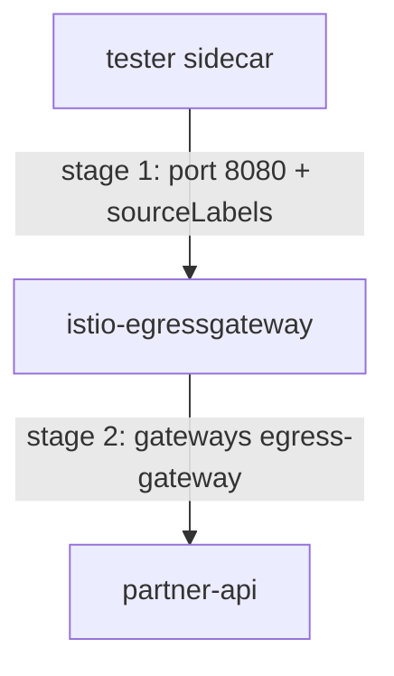

# Solution Walkthrough

The lab needs four objects. Three are simple. The `VirtualService` needs the most care, because one object configures two different proxies: the `tester` sidecar proxy and the egress gateway.

---

## Step 1: Confirm The Egress Gateway Is Idle

First read the partner address, check that the egress gateway runs, send a direct request from `tester`, and count the partner lines in the egress gateway's access log:

```sh
PARTNER=$(cat /tmp/partner-ip); echo "partner: $PARTNER"
kubectl -n istio-system get pods -l istio=egressgateway
kubectl -n egwgw-demo exec deploy/tester -- \
  curl -s -o /dev/null -w 'direct call: %{http_code}\n' --max-time 10 "http://$PARTNER:8080/get"
kubectl -n istio-system logs deploy/istio-egressgateway --tail=-1 | grep -c partner || echo 0
```

```text
partner: 10.244.0.19
NAME                                   READY   STATUS    AGE
istio-egressgateway-7f4b6d8c9d-2wnzq   1/1     Running   8m
direct call: 200
0
```

The egress gateway is running, and the request works. But the egress gateway's access log recorded nothing: the request went straight out through the `tester` pod's own sidecar proxy. **A deployed egress gateway proves nothing by itself.**

---

## Step 2: Add The Partner Host With A `ServiceEntry`

A `ServiceEntry` adds a host outside the mesh to the service registry, the list of hosts that `istiod` knows about. Without it, neither stage of the route has a host to route. Read the partner address into a variable:

```sh
PARTNER=$(cat /tmp/partner-ip)
```

Replace `<PARTNER>` in the YAML below with the real address. To see it, run `echo $PARTNER`.

Save this as `serviceentry-partner.yaml`:

```yaml
apiVersion: networking.istio.io/v1
kind: ServiceEntry
metadata:
  name: partner
  namespace: egwgw-demo
spec:
  hosts:
    - partner.example.com
  addresses:
    - <PARTNER>
  ports:
    - number: 8080
      name: http
      protocol: HTTP
  location: MESH_EXTERNAL
  resolution: STATIC
  endpoints:
    - address: <PARTNER>
```

Apply it:

```sh
kubectl apply -f serviceentry-partner.yaml
```

---

## Step 3: Write The `Gateway` And The `DestinationRule`

The `Gateway` makes the egress gateway's pods accept requests for the partner host on port `8080`. Save this as `gateway-egress-gateway.yaml`:

```yaml
apiVersion: networking.istio.io/v1
kind: Gateway
metadata:
  name: egress-gateway
  namespace: egwgw-demo
spec:
  selector:
    istio: egressgateway
  servers:
    - port:
        number: 8080
        name: http
        protocol: HTTP
      hosts:
        - partner.example.com
```

Apply it:

```sh
kubectl apply -f gateway-egress-gateway.yaml
```

The `DestinationRule` gives stage 1 a named subset of the egress gateway's Service. Save this as `destinationrule-egressgateway-for-partner.yaml`:

```yaml
apiVersion: networking.istio.io/v1
kind: DestinationRule
metadata:
  name: egressgateway-for-partner
  namespace: egwgw-demo
spec:
  host: istio-egressgateway.istio-system.svc.cluster.local
  subsets:
    - name: partner
```

Apply it:

```sh
kubectl apply -f destinationrule-egressgateway-for-partner.yaml
```

Two things here look wrong and are not:

- **`hosts: [partner.example.com]`** is the **outside** host name. Read the object from the egress gateway's point of view: it receives requests whose `Host` header says `partner.example.com`, so that is the host its listener must accept. An internal name here gives you an egress gateway that rejects every request.
- **A subset with no labels** narrows nothing. It exists so that stage 1 can name a separate cluster for each outside host. With several hosts through one egress gateway, each gets its own subset, and the proxy configuration stays readable.

Note `selector: istio: egressgateway`. That label selects the **egress** gateway. Using `ingressgateway` here configures the wrong pod.

---

## Step 4: Write The Two-Stage `VirtualService`

The `VirtualService` holds both stages. Save this as `virtualservice-partner-through-egress.yaml`:

```yaml
apiVersion: networking.istio.io/v1
kind: VirtualService
metadata:
  name: partner-through-egress
  namespace: egwgw-demo
spec:
  hosts:
    - partner.example.com
  gateways:
    - mesh
    - egress-gateway
  http:
    - match:
        - port: 8080
          sourceLabels:
            egress-allowed: "true"
      route:
        - destination:
            host: istio-egressgateway.istio-system.svc.cluster.local
            subset: partner
            port:
              number: 8080
    - match:
        - gateways: [egress-gateway]
          port: 8080
      route:
        - destination:
            host: partner.example.com
            port:
              number: 8080
```

Apply it:

```sh
kubectl apply -f virtualservice-partner-through-egress.yaml
```

One object holds two rules, and each rule runs in a different proxy:



The diagram shows stage 1 running in the `tester` sidecar and sending the request to the egress gateway, and stage 2 running in the egress gateway and sending it on to `partner-api`.

The top-level `gateways` must list **both** names. If you leave out `mesh`, `istiod` never gives stage 1 to the sidecars, so no request goes to the egress gateway. If you leave out the egress gateway, stage 2 never reaches the egress gateway.

---

## Step 5: Prove The Hop

The response looks the same either way, so the proof must come from the egress gateway's access log. Count its lines before and after one request from `tester`:

```sh
PARTNER=$(cat /tmp/partner-ip)
BEFORE=$(kubectl -n istio-system logs deploy/istio-egressgateway --tail=-1 | grep -c partner.example.com)
kubectl -n egwgw-demo exec deploy/tester -- \
  curl -s -o /dev/null -w 'tester: %{http_code}\n' --max-time 15 "http://partner.example.com:8080/get"
sleep 3
AFTER=$(kubectl -n istio-system logs deploy/istio-egressgateway --tail=-1 | grep -c partner.example.com)
echo "gateway lines: +$((AFTER - BEFORE))"
kubectl -n istio-system logs deploy/istio-egressgateway --tail=5 | grep partner.example.com | tail -1
```

```text
tester: 200
gateway lines: +1
[2026-09-27T13:22:41.006Z] "GET /get HTTP/1.1" 200 - via_upstream - "-" 0 3428 4 3 "10.244.0.28" "curl/8.5.0" "..." "partner.example.com" "10.244.0.19:8080" ...
```

The egress gateway logged one line, with the address of the calling pod in it. That log is the audit record the whole setup exists to produce.

The `tester` sidecar's routes confirm the same thing from the configuration side:

```sh
istioctl proxy-config routes deploy/tester -n egwgw-demo -o json | grep -i '"cluster"' | grep egress | head -1
```

```text
"cluster": "outbound|8080|partner|istio-egressgateway.istio-system.svc.cluster.local",
```

The destination of `tester` for the outside host is now a Service inside the cluster, with `|partner|`, the subset, in the cluster name.

---

## Step 6: See What `sourceLabels` Really Does

Now repeat the count with a request from `other-client`:

```sh
PARTNER=$(cat /tmp/partner-ip)
BEFORE=$(kubectl -n istio-system logs deploy/istio-egressgateway --tail=-1 | grep -c partner.example.com)
kubectl -n egwgw-demo exec deploy/other-client -- \
  curl -s -o /dev/null -w 'other-client: %{http_code}\n' --max-time 15 "http://partner.example.com:8080/get"
sleep 3
AFTER=$(kubectl -n istio-system logs deploy/istio-egressgateway --tail=-1 | grep -c partner.example.com)
echo "gateway lines: +$((AFTER - BEFORE))"
```

```text
other-client: 200
gateway lines: +0
```

The `other-client` pods do not carry `egress-allowed: "true"`, so stage 1 did not apply to them. They **still reached the endpoint**, directly, with no line in the egress gateway's access log.

`sourceLabels` limits the **route**, not the permission. A workload that does not match goes direct; it is not blocked. To make the egress gateway a real control, you also need `outboundTrafficPolicy: REGISTRY_ONLY`, so that requests to hosts outside the service registry are blocked, plus an `AuthorizationPolicy` on the egress gateway.

---

## Common Mistakes

- **Expecting the egress gateway to catch traffic.** It carries nothing until a route sends traffic to it. The `0` in step 1 proves it.
- **An internal host name in the `Gateway`'s `servers[].hosts`.** It must be the outside host.
- **`selector: istio: ingressgateway`.** That is the wrong gateway; it serves inbound traffic.
- **Swapping the two `match.gateways` values.** Requests loop, or never go to the egress gateway.
- **`mesh` missing from the top-level `gateways`.** Stage 1 never reaches the sidecars.
- **No `ServiceEntry`.** Neither stage has a host to route.
- **Counting egress gateway log lines without a baseline.** The log keeps growing.
- **Reading `sourceLabels` as access control.** It only filters the route; workloads that do not match go direct.
