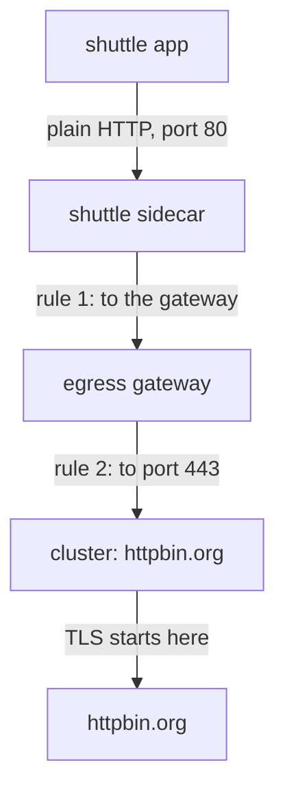

# Route Plain HTTP Through The Egress Gateway

An application that sends plain `http://` to a server that only speaks HTTPS gets an error. TLS origination fixes this: a proxy on the way opens the TLS (Transport Layer Security) connection for the application. Before a proxy can do that, the request must reach it. In this part you build the four objects that route a request from the `shuttle` pod through the egress gateway, an Envoy proxy at the edge of the mesh that outgoing traffic passes through. The request will fail in a way that shows exactly what the fifth object is for.

## The path of one request

Start with one plain `http://` request from the `shuttle` pod to `httpbin.org`, and follow it from the application to the external host:



The diagram shows the sidecar proxy sending the request to the egress gateway, and the egress gateway sending it on to port `443` of `httpbin.org`, with TLS added as it leaves.

The application sends plain HTTP and knows nothing else. The sidecar proxy sends the request to the egress gateway. The egress gateway accepts it on port `80`, routes it to port `443` of the external host, and starts TLS on that connection. Without an egress gateway, the sidecar proxy would do all of these steps itself. Here the same work moves one hop outward, to the egress gateway.

## Five objects, one job each

Each step of the path is set by one Istio object. Two of them are `DestinationRule` objects that name two different hosts, and keeping them apart is most of the work:

| # | Object | Its job |
| --- | --- | --- |
| 1 | `ServiceEntry` `httpbin-org` | adds `httpbin.org` to the service registry, with ports `80` and `443` |
| 2 | `Gateway` `departure-gate` | opens port `80` on the egress gateway pods for the host `httpbin.org` |
| 3 | `DestinationRule` `departure-gate` | defines the empty subset of the **egress gateway's Service** that rule 1 sends to |
| 4 | `VirtualService` `httpbin-org-via-gate` | rule 1 (sidecar proxy to egress gateway) and rule 2 (egress gateway to `httpbin.org` on port `443`) |
| 5 | `DestinationRule` for **`httpbin.org`** | turns on TLS for port `443` |

A **`DestinationRule`** sets how a proxy connects to one host: subsets, load balancing and TLS settings. A **`VirtualService`** sets where a request for a host goes. The names `departure-gate` and `httpbin-org-via-gate` are only object names; you can pick any names.

The two port numbers on the egress gateway can look like a mismatch. They describe two directions. Port `80` in the `Gateway`'s `servers[].port` is where the egress gateway **listens** for plain requests from inside the cluster. Port `443` in rule 2's `destination.port` is where the egress gateway **sends** the request on, to the external host. A proxy receives on one port and sends on another, so both numbers are correct.

## Build the route

You now apply the first four objects, one at a time, and then send a request through them.

<!-- astrona:playground:renew -->

Start with the `ServiceEntry`. A **`ServiceEntry`** adds a host outside the mesh to Istio's service registry, the list of hosts the proxies know how to reach. This one lists both ports: `80` for the plain request the application sends, and `443` for the TLS connection the egress gateway opens. Save this as `serviceentry-httpbin-org.yaml`:

```yaml
apiVersion: networking.istio.io/v1
kind: ServiceEntry
metadata:
  name: httpbin-org
  namespace: starfleet
spec:
  hosts:
  - httpbin.org
  ports:
  - number: 80
    name: http
    protocol: HTTP
  - number: 443
    name: https
    protocol: HTTPS
  location: MESH_EXTERNAL
  resolution: DNS
```

Apply it:

```sh
kubectl apply -f serviceentry-httpbin-org.yaml
```

Next comes the `Gateway`. A **`Gateway`** configures a listener (a port the proxy accepts connections on) on the gateway pods it selects. This one selects the egress gateway pods by their label `istio: egress` and opens port `80` for the **external** host. Read `hosts` from the egress gateway's side: these are the hosts it accepts requests for. Save this as `gateway-departure-gate.yaml`:

```yaml
apiVersion: networking.istio.io/v1
kind: Gateway
metadata:
  name: departure-gate
  namespace: starfleet
spec:
  selector:
    istio: egress
  servers:
  - port:
      number: 80
      name: http
      protocol: HTTP
    hosts:
    - httpbin.org
```

Apply it:

```sh
kubectl apply -f gateway-departure-gate.yaml
```

Rule 1 names a subset of the egress gateway's Service, so that subset must exist first. This `DestinationRule` is about the **egress gateway's own Service**. Its subset has no labels, so it selects every egress gateway pod. Save this as `destinationrule-departure-gate.yaml`:

```yaml
apiVersion: networking.istio.io/v1
kind: DestinationRule
metadata:
  name: departure-gate
  namespace: starfleet
spec:
  host: istio-egress.istio-egress.svc.cluster.local
  subsets:
  - name: httpbin-org
```

Apply it:

```sh
kubectl apply -f destinationrule-departure-gate.yaml
```

The `VirtualService` holds both routing rules. Rule 1 matches the gateway name `mesh`, so it runs in every sidecar proxy: a request to `httpbin.org` on port `80` goes to the egress gateway. Rule 2 matches `departure-gate`, so it runs in the egress gateway: the same request goes on to `httpbin.org` on port **443**. Save this as `virtualservice-httpbin-org-via-gate.yaml`:

```yaml
apiVersion: networking.istio.io/v1
kind: VirtualService
metadata:
  name: httpbin-org-via-gate
  namespace: starfleet
spec:
  hosts:
  - httpbin.org
  gateways:
  - mesh
  - departure-gate
  http:
  - match:
    - gateways:
      - mesh
      port: 80
    route:
    - destination:
        host: istio-egress.istio-egress.svc.cluster.local
        subset: httpbin-org
        port:
          number: 80
  - match:
    - gateways:
      - departure-gate
      port: 80
    route:
    - destination:
        host: httpbin.org
        port:
          number: 443
```

Apply it:

```sh
kubectl apply -f virtualservice-httpbin-org-via-gate.yaml
```

## Send a request through the egress gateway

With four objects in place, send one plain request and read both access logs. The helper functions `call_httpbin`, `log_shuttle` and `log_gate` must be defined in your terminal:

```sh
call_httpbin
log_shuttle
log_gate
```

You should see (log lines shortened):

```text
400
"GET /get HTTP/1.1" 400 - via_upstream - "-" 0 220 241 240 "-" "curl/8.11.1" ... "httpbin.org" "10.244.0.6:80" outbound|80|httpbin-org|istio-egress.istio-egress.svc.cluster.local ...
"GET /get HTTP/2" 400 - via_upstream - "-" 0 220 238 237 "10.244.0.7" "curl/8.11.1" ... "httpbin.org" "98.88.155.171:443" outbound|443||httpbin.org ...
```

The route works. The shuttle's line ends at `10.244.0.6:80`, the egress gateway pod. The egress gateway's line ends at an internet address on port `443`, through the cluster `outbound|443||httpbin.org`. A **cluster** is Envoy's name for one destination and the settings to connect to it. But the response is `400`. Read the whole response to find out why:

```sh
kubectl exec -n starfleet deploy/shuttle -- curl -s http://httpbin.org/get
```

You should see (shortened to the title):

```text
<head><title>400 The plain HTTP request was sent to HTTPS port</title></head>
```

The egress gateway sent the plain request to the HTTPS port. Nothing started TLS, because no object told the egress gateway to do so.

You now have a working route: the sidecar proxy sends the request to the egress gateway on port `80`, and the egress gateway sends it on to port `443`. Both access logs prove each hop. The open question is which object turns on TLS for that last hop, and which host it must name.

## Common pitfalls

> [!WARNING]
> - **Expecting the listener port and the onward port to match.** The egress gateway listens on `80` and sends on `443`. Both numbers are correct.
> - **Naming the egress gateway's own Service in the `Gateway`'s `hosts`.** The `Gateway` lists the external host, the one the egress gateway accepts requests for.
> - **Applying the `VirtualService` before the subset exists.** Rule 1 then points at a subset that no `DestinationRule` defines. Apply the `DestinationRule` first.
> - **Reading only the status code.** The `400` came from `httpbin.org` itself. Both access logs show the route worked; only TLS is missing.
