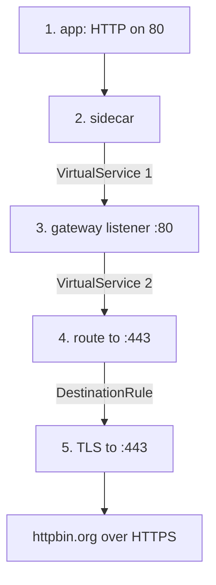

# The Five-Step Chain

A signal's journey here has five steps, and each step is owned by one object. Two of them are where every mistake in this module lives, so walk the whole flight path before you write anything, astronaut.

## The path



Without an egress gateway, the communications officer on the ship (the sidecar) does steps 3 to 5 itself. Nothing new happens here: the same work has moved one hop outward, to the departure gate.

## Step 4 — the route targets 443, the listener stays on 80

This is the first place people go wrong, because the two port numbers on the gateway look inconsistent.

They are not. They describe different directions:

| | Port | What it is |
| --- | --- | --- |
| `Gateway.servers[].port` | **80** | the port the gateway **accepts** traffic on, from inside the cluster |
| Stage 2's `destination.port` | **443** | the port the gateway **sends** traffic to, outside the cluster |

The gateway is a proxy: it listens on one radio channel (port) and transmits on another. Route step 4 to port 80 of the external host, and the gate faithfully forwards plaintext to an HTTPS endpoint. That fails, and the failure looks like a TLS problem when it is really a routing one.

## Step 5 — the `DestinationRule` targets the external host

This is the second, and it is the more interesting mistake because it follows from a rule you already know.

The `DestinationRule` that originates TLS names **`httpbin.org`** — the external host — **not** the gateway's own Service:

```yaml
apiVersion: networking.istio.io/v1
kind: DestinationRule
metadata:
  name: originate-tls-for-httpbin
  namespace: egwtls-demo
spec:
  host: httpbin.org                # ← the EXTERNAL host
  trafficPolicy:
    portLevelSettings:
      - port:
          number: 443
        tls:
          mode: SIMPLE
          sni: httpbin.org
```

The reason is section 030's rule: **traffic policy attaches to a destination and is applied by whichever proxy is calling it.** Think of docking instructions: they belong to the planet you approach, and the ship doing the approach follows them. The gateway is the one calling `httpbin.org`, so the gateway is where this policy takes effect.

Put it on `istio-egressgateway.istio-system.svc.cluster.local` instead and nothing originates — because that is the policy for calls *to the gateway*, which is the sidecar's leg, and that leg is plain HTTP by design.

So this object is byte-for-byte the same as section 070 module 2's, applied by a different proxy because a different proxy is making the call. That is the whole difference between the two modules.

## The `ServiceEntry` needs both ports again

Same reason as section 070 module 2: port 80 is where the traffic arrives from the sidecar, port 443 is where it goes.

```yaml
ports:
  - number: 80
    name: http
    protocol: HTTP
  - number: 443
    name: https
    protocol: HTTPS
```

Declare only 443 and stage 2 has no port-80 entry to start from.

## The five objects

| # | Object | Job |
| --- | --- | --- |
| 1 | `ServiceEntry` | the external host in the registry, with ports 80 and 443 |
| 2 | `Gateway` | a listener on the egress gateway, port 80, for the external hostname |
| 3 | `DestinationRule` on the **gateway Service** | the empty `partner`-style subset, so stage 1 can name a cluster |
| 4 | `VirtualService` | two stages: sidecar → gateway, gateway → external host **on 443** |
| 5 | `DestinationRule` on the **external host** | `tls.mode: SIMPLE` under `portLevelSettings` for 443 |

Two `DestinationRule` objects pointing at two different hosts, doing two unrelated jobs. Keeping them apart is most of the work.

<!-- astrona:playground:renew -->

> [!TIP]
> **Try it — the whole chain in one apply**
>
> Save this as `serviceentry-httpbin-ext.yaml`:
>
> ```yaml
> apiVersion: networking.istio.io/v1
> kind: ServiceEntry
> metadata:
>   name: httpbin-ext
>   namespace: egwtls-demo
> spec:
>   hosts:
>     - httpbin.org
>   ports:
>     - number: 80
>       name: http
>       protocol: HTTP
>     - number: 443
>       name: https
>       protocol: HTTPS
>   location: MESH_EXTERNAL
>   resolution: DNS
> ---
> apiVersion: networking.istio.io/v1
> kind: Gateway
> metadata:
>   name: istio-egressgateway
>   namespace: egwtls-demo
> spec:
>   selector:
>     istio: egressgateway
>   servers:
>     - port:
>         number: 80
>         name: http
>         protocol: HTTP
>       hosts:
>         - httpbin.org
> ---
> apiVersion: networking.istio.io/v1
> kind: DestinationRule
> metadata:
>   name: egressgateway-for-httpbin
>   namespace: egwtls-demo
> spec:
>   host: istio-egressgateway.istio-system.svc.cluster.local
>   subsets:
>     - name: httpbin
> ---
> apiVersion: networking.istio.io/v1
> kind: VirtualService
> metadata:
>   name: httpbin-through-egress
>   namespace: egwtls-demo
> spec:
>   hosts:
>     - httpbin.org
>   gateways:
>     - mesh
>     - istio-egressgateway
>   http:
>     - match:
>         - gateways: [mesh]
>           port: 80
>       route:
>         - destination:
>             host: istio-egressgateway.istio-system.svc.cluster.local
>             subset: httpbin
>             port:
>               number: 80
>     - match:
>         - gateways: [istio-egressgateway]
>           port: 80
>       route:
>         - destination:
>             host: httpbin.org
>             port:
>               number: 443
> ---
> apiVersion: networking.istio.io/v1
> kind: DestinationRule
> metadata:
>   name: originate-tls-for-httpbin
>   namespace: egwtls-demo
> spec:
>   host: httpbin.org
>   trafficPolicy:
>     portLevelSettings:
>       - port:
>           number: 443
>         tls:
>           mode: SIMPLE
>           sni: httpbin.org
> ```
>
> Apply it:
>
> ```sh
> kubectl apply -f serviceentry-httpbin-ext.yaml
> ```
>
> Then check the result:
>
> ```sh
> sleep 4
> kubectl -n egwtls-demo exec deploy/tester -- \
>   curl -s -o /dev/null -w 'http:// call: %{http_code}\n' --max-time 20 http://httpbin.org/get
> ```
>
> Expect something like:
>
> ```text
> http:// call: 200
> ```
>
> A plain `http://` signal from an app that knows nothing about any of this, answered over a TLS connection made two hops away. As in module 1, the response alone proves nothing — Part 2 is the evidence.

> *The gateway receives on 80 and sends on 443 — the two port numbers are the two directions, not an inconsistency.*

## Common pitfalls

> [!WARNING]
> **Expecting the gateway listener port and the route's target port to match.** The listener stays on 80 because that is where traffic arrives; the route targets 443 because that is where it is going. Both numbers are correct.
>
> **Declaring one port on the `ServiceEntry`.** Both 80 and 443 are needed, for the same reason as section 070.
>
> **Attaching the TLS `DestinationRule` to the gateway Service.** It attaches to the *external host*, because that is the destination whose connection is being secured.
>
> **Losing track of which of the five steps failed.** Each step has its own object and its own proxy. Part 2's diagnostic order exists for this.
