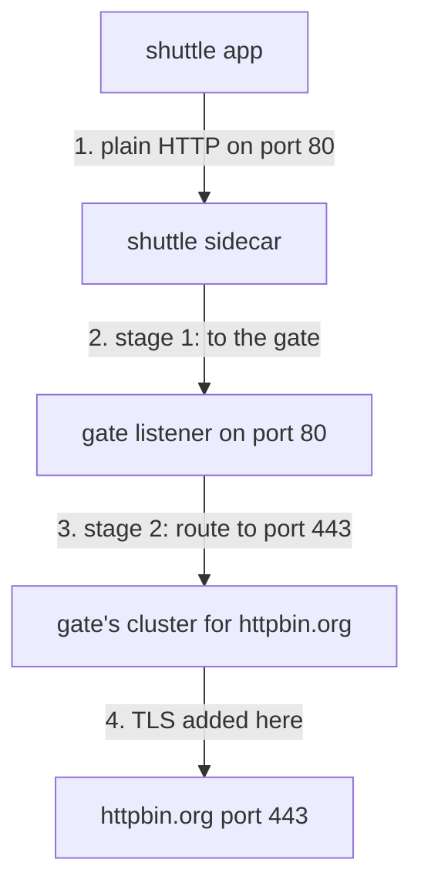

# The Five-Step Chain

A signal that leaves through the departure gate with a lock put on makes five steps, and each step is owned by one object. In this part you build the first four objects and send a signal through the gate. It will fail in a way that tells you exactly what the fifth object is for.

## The path

Follow one plain `http://` signal from the shuttle to `httpbin.org`:



The app sends plain HTTP and knows nothing else. The sidecar sends it to the gate. The gate accepts it on port `80`, routes it to port `443` of the outside host, and puts the lock on as it leaves. Without a gate, the sidecar would do all of these steps itself. Here the same work moves one hop outward, to the departure gate.

## Five objects, one job each

Each object owns one piece of the path. Two of them are `DestinationRule` objects that point at two different hosts, and keeping them apart is most of the work.

| # | Object | Its job |
| --- | --- | --- |
| 1 | `ServiceEntry` `httpbin-org` | puts `httpbin.org` on the star chart, with ports `80` and `443` |
| 2 | `Gateway` `departure-gate` | opens port `80` on the gate's pods for the host `httpbin.org` |
| 3 | `DestinationRule` `departure-gate` | names the empty subset of the **gate's Service** that stage 1 flies to |
| 4 | `VirtualService` `httpbin-org-via-gate` | stage 1 (sidecar to gate) and stage 2 (gate to `httpbin.org` on port `443`) |
| 5 | `DestinationRule` for **`httpbin.org`** | puts the TLS lock on at port `443` |

## The gate listens on 80 and sends to 443

The two port numbers on the gate look like a mismatch. They are not. They describe two directions:

| Where | Port | What it is |
| --- | --- | --- |
| `Gateway` `servers[].port` | **80** | the radio channel the gate **listens** on, for signals from inside the cluster |
| stage 2 `destination.port` | **443** | the radio channel the gate **sends** on, to the outside host |

The gate is a proxy. It listens on one channel and sends on another. Port `80` is where the plain signal arrives, and port `443` is where the sealed signal goes.

<!-- astrona:playground:renew -->

### Put the outside host on the star chart

Start with the `ServiceEntry`. It lists both ports: `80` for the plain signal your ship sends, and `443` for the sealed signal the gate sends on. Save this as `serviceentry-httpbin-org.yaml`:

```yaml
apiVersion: networking.istio.io/v1
kind: ServiceEntry
metadata:
  name: httpbin-org
  namespace: starfleet
spec:
  hosts:
  - httpbin.org
  ports:
  - number: 80
    name: http
    protocol: HTTP
  - number: 443
    name: https
    protocol: HTTPS
  location: MESH_EXTERNAL
  resolution: DNS
```

Apply it:

```sh
kubectl apply -f serviceentry-httpbin-org.yaml
```

### Open the gate on port 80

The `Gateway` selects the gate's pods by their label `istio: egress` and opens port `80` for the **outside** host. Read `hosts` from the gate's point of view: these are the hosts the gate is willing to carry. Save this as `gateway-departure-gate.yaml`:

```yaml
apiVersion: networking.istio.io/v1
kind: Gateway
metadata:
  name: departure-gate
  namespace: starfleet
spec:
  selector:
    istio: egress
  servers:
  - port:
      number: 80
      name: http
      protocol: HTTP
    hosts:
    - httpbin.org
```

Apply it:

```sh
kubectl apply -f gateway-departure-gate.yaml
```

### Name the subset that stage 1 flies to

This `DestinationRule` is about the **gate's own Service**. Its subset has no labels, so it selects every gate pod. It narrows nothing, but stage 1 names it, so it must exist. Save this as `destinationrule-departure-gate.yaml`:

```yaml
apiVersion: networking.istio.io/v1
kind: DestinationRule
metadata:
  name: departure-gate
  namespace: starfleet
spec:
  host: istio-egress.istio-egress.svc.cluster.local
  subsets:
  - name: httpbin-org
```

Apply it:

```sh
kubectl apply -f destinationrule-departure-gate.yaml
```

### Write the two-stage flight plan

Stage 1 is the rule for `mesh`: in every sidecar, a signal to `httpbin.org` on port `80` flies to the gate. Stage 2 is the rule for `departure-gate`: on the gate, the same signal flies on to `httpbin.org` on port **443**. Save this as `virtualservice-httpbin-org-via-gate.yaml`:

```yaml
apiVersion: networking.istio.io/v1
kind: VirtualService
metadata:
  name: httpbin-org-via-gate
  namespace: starfleet
spec:
  hosts:
  - httpbin.org
  gateways:
  - mesh
  - departure-gate
  http:
  - match:
    - gateways:
      - mesh
      port: 80
    route:
    - destination:
        host: istio-egress.istio-egress.svc.cluster.local
        subset: httpbin-org
        port:
          number: 80
  - match:
    - gateways:
      - departure-gate
      port: 80
    route:
    - destination:
        host: httpbin.org
        port:
          number: 443
```

Apply it:

```sh
kubectl apply -f virtualservice-httpbin-org-via-gate.yaml
```

### Send a signal through the gate

Four objects are in place. Send one plain signal and read both flight logs:

```sh
call_httpbin
log_shuttle
log_gate
```

You should see (log lines trimmed):

```text
400
"GET /get HTTP/1.1" 400 - via_upstream - "-" 0 220 241 240 "-" "curl/8.11.1" ... "httpbin.org" "10.244.0.6:80" outbound|80|httpbin-org|istio-egress.istio-egress.svc.cluster.local ...
"GET /get HTTP/2" 400 - via_upstream - "-" 0 220 238 237 "10.244.0.7" "curl/8.11.1" ... "httpbin.org" "98.88.155.171:443" outbound|443||httpbin.org ...
```

The route works. The shuttle's line ends at `10.244.0.6:80`, the gate's pod. The gate's line ends at an internet address on port `443`, through the cluster `outbound|443||httpbin.org`. But the answer is `400`. Read the whole answer to find out why:

```sh
kubectl exec -n starfleet deploy/shuttle -- curl -s http://httpbin.org/get
```

You should see (trimmed to the title):

```text
<head><title>400 The plain HTTP request was sent to HTTPS port</title></head>
```

The gate sent the plain signal to the HTTPS port. Nothing put the lock on, because nothing told the gate to. That is the job of the fifth object.

## Common pitfalls

> [!WARNING]
> - **Expecting the listener port and the onward port to match.** The gate listens on `80` and sends on `443`. Both numbers are correct.
> - **Naming the gate's own Service in the `Gateway`'s `hosts`.** The `Gateway` lists the outside host, the one the gate carries signals for.
> - **Applying the `VirtualService` before the subset exists.** Stage 1 then points at a subset nobody defined. Apply the `DestinationRule` first.
> - **Reading only the status code.** The `400` came from `httpbin.org` itself. Both flight logs show the route worked; only the lock is missing.

> *The gate listens on port 80 and sends on port 443. Four objects build the route; the fifth puts the lock on.*
